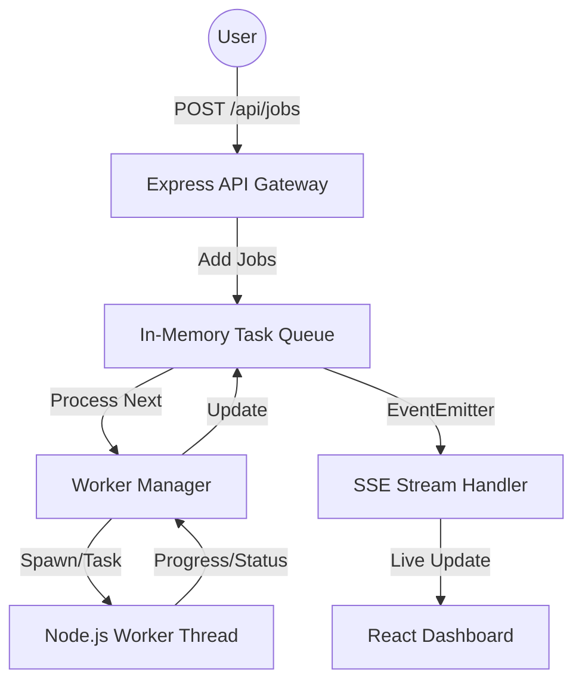

# 🚀 Distributed Task Queue & Worker Visualizer

A robust, non-blocking background processing system with a real-time "Cyberpunk Terminal" monitoring dashboard. Built with Node.js **Worker Threads**, **SSE (Server-Sent Events)**, and **React + Tailwind CSS v4**.

 *(Note: Add your actual screenshot path here or rely on the live preview)*

## 🛠️ Tech Stack

- **Frontend**: React (Vite), Tailwind CSS v4, Framer Motion, Lucide React.
- **Backend**: Node.js, Express, Worker Threads (True Concurrency).
- **Communication**: SSE (Server-Sent Events) for live unidirectional data streaming.
- **Monorepo**: npm Workspaces, `concurrently`.

## ✨ Features

- **Cyberpunk Terminal UI**: High-fidelity dark mode with glassmorphism, animated progress bars, and tactile feedback.
- **True Non-Blocking Architecture**: Heavy task simulations run on a separate CPU thread, keeping the API and UI perfectly responsive.
- **Real-Time Stream**: The dashboard updates instantly whenever a job changes status, without the overhead of polling or full WebSockets.
- **Resilient Worker**: Simulates real-world conditions including variable processing times and random failure rates (~15%).

## 🏗️ Architecture



## 🚀 Getting Started

### Prerequisites

- Node.js (v18+)
- npm (v7+ for workspaces)

### Installation

1. Clone the repository:
   ```bash
   git clone https://github.com/jbrandons13/async-worker-dashboard.git
   cd async-worker-dashboard
   ```

2. Install dependencies for the entire monorepo:
   ```bash
   npm install
   ```

### Running Locally

To start both the backend and frontend simultaneously:

```bash
npm run dev
```

- **Frontend**: [http://localhost:5173](http://localhost:5173)
- **Backend API**: [http://localhost:3001](http://localhost:3001)

## 📂 Project Structure

```text
/
├── backend/            # Express Server + Worker logic
│   ├── queue/          # Task Queue implementation
│   └── worker/         # Worker simulation script
├── frontend/           # React + Vite + Tailwind v4
│   ├── src/hooks/      # Custom SSE stream hook
│   └── src/components/ # Dashboard & JobCard components
└── package.json        # Root workspace configuration
```

## 📄 License

This project is open-source and free to use.

---
**Node-Worker Core Engine // REDESIGN 2026**
